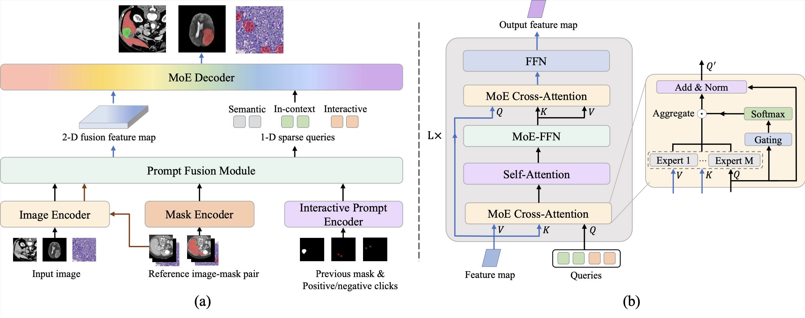

# K-Prism: A knowledge-guided and prompt integrated universal medical image segmentation model

## Abstract
Medical image segmentation is fundamental to clinical decision-making, yet ex- isting models remain fragmented. They are usually trained on single knowledge sources and specific to individual tasks, modalities, or organs. This fragmentation contrasts sharply with clinical practice, where experts seamlessly integrate diverse knowledge: anatomical priors from training, exemplar-based reasoning from ref- erence cases, and iterative refinement through real-time interaction. We present K-Prism, a unified segmentation framework that mirrors this clinical flexibility by systematically integrating three knowledge paradigms: (i) semantic priors learned from annotated datasets, (ii) in-context knowledge from few-shot reference exam- ples, and (iii) interactive feedback from user inputs like clicks or scribbles. Our key insight is that these heterogeneous knowledge sources can be encoded into a dual-prompt representation: 1-D sparse prompts defining what to segment and 2-D dense prompts indicating where to attend, which are then dynamically routed through a Mixture-of-Experts (MoE) decoder. This design enables flexible switch- ing between paradigms and joint training across diverse tasks without architectural modifications. Comprehensive experiments on 18 public datasets spanning di- verse modalities (CT, MRI, X-ray, pathology, ultrasound, etc.) demonstrate that K-Prism achieves state-of-the-art performance across semantic, in-context, and interactive segmentation settings.

## Features
* Unified Segmentation Framework: A single model that supports semantic, in-context (few-shot), and interactive medical image segmentation without task-specific architectures.

* Dual-Prompt Representation: Encodes heterogeneous knowledge into a unified prompt space: 1D sparse prompts to specify what to segment and 2D dense prompts to indicate where to attend.

* Mixture-of-Experts (MoE) Decoder: Dynamically routes prompts through expert decoders, enabling flexible switching and composition of segmentation paradigms during inference.

## Example
Below is an example visualization of our K-Prism framework:



## Updates
*  Code will be released upon publication


## Citation

```bibtex
@article{guo2025k,
  title={K-Prism: A Knowledge-Guided and Prompt Integrated Universal Medical Image Segmentation Model},
  author={Guo, Bangwei and Gao, Yunhe and Ye, Meng and Gu, Difei and Zhou, Yang and Axel, Leon and Metaxas, Dimitris},
  journal={arXiv preprint arXiv:2509.25594},
  year={2025}
}
```
